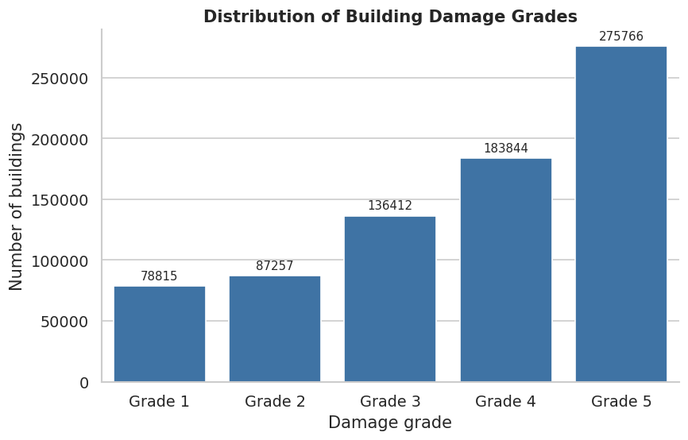
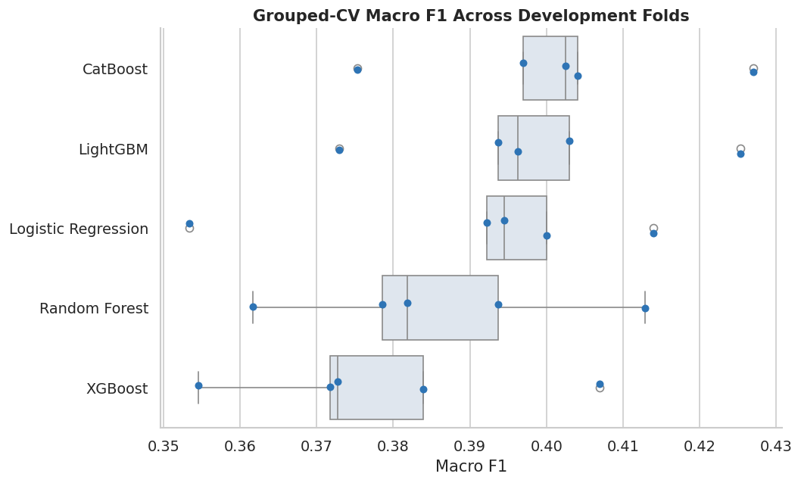
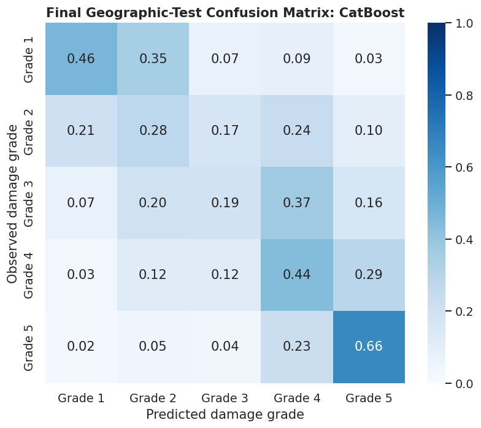
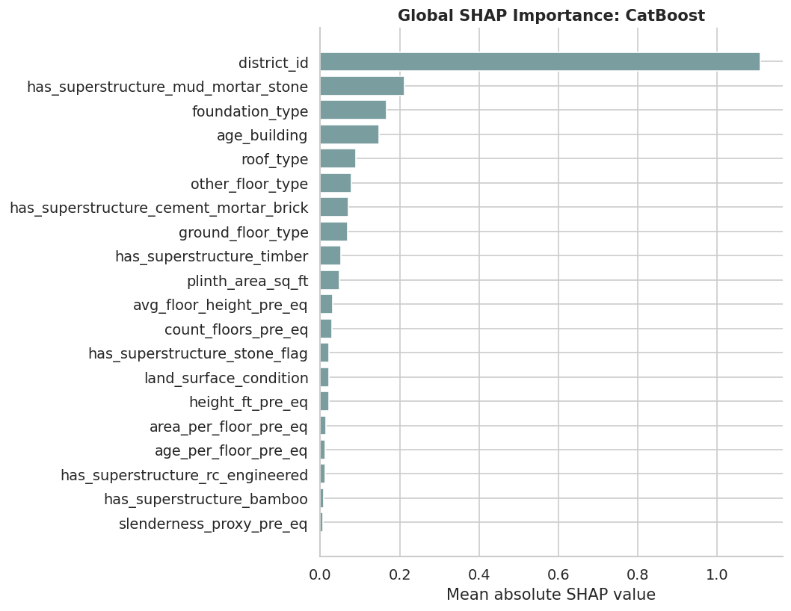

# Earthquake Building Damage Assessment

Interpretable machine learning for predicting five levels of earthquake building damage from pre-earthquake structural characteristics and geographic context. The analysis compares classification models, evaluates transfer to held-out municipalities, and examines the features associated with model predictions.

The [analysis notebook](earthquake-damage-assesment-factors.ipynb) contains the code, recorded outputs, and interpretation. All results below come from its saved execution; the dataset and trained models are not bundled with this repository.

## Dataset

The notebook uses `csv_building_structure.csv` from the Kaggle dataset identified as `arashnic/earthquake-magnitude-damage-and-impact`. Each row represents a building in the Nepal earthquake building-structure data. The target, `damage_grade`, is included in the same file.

| Property | Recorded value |
| --- | ---: |
| Raw buildings | 762,106 |
| Original columns | 31 |
| Missing damage labels removed | 12 |
| Exact duplicate rows | 0 |
| Buildings used for modeling | 762,094 |
| Districts / municipalities | 11 / 110 |
| Target classes | Grade 1–Grade 5 |

Grade 5 accounts for 36.19% of labeled buildings, compared with 10.34% for Grade 1. Macro F1 is the main model-selection metric because it gives each class equal weight.



## Methodology

1. **Audit and clean:** inspect types, missing values, duplicate records, and possible target leakage; remove records without a target.
2. **Restrict predictors:** exclude `building_id` and four post-event variables: `count_floors_post_eq`, `height_ft_post_eq`, `condition_post_eq`, and `technical_solution_proposed`.
3. **Engineer structural features:** calculate height per floor, plinth area divided by floor count, height divided by the square root of plinth area, and age per floor. These are numerical proxies, not verified engineering measurements.
4. **Separate geographic groups:** reserve the first fold of a five-fold `StratifiedGroupKFold` split as the final test set, grouping by `vdcmun_id`. Development contains 614,499 buildings from 87 municipalities; testing contains 147,595 buildings from 23 municipalities, with no municipality overlap.
5. **Benchmark and tune:** compare five classifiers using five-fold grouped development validation. Tune the top two with 15 randomized configurations each, optimizing macro F1.
6. **Evaluate and interpret:** report class-level performance, geographic differences, permutation importance, SHAP, partial dependence, and individual conditional expectation curves.

The primary scenario uses **27 predictors: structural features plus district ID**. Numerical median imputation and categorical mode imputation/one-hot encoding are fitted within each training fold. Logistic regression additionally scales numerical features. CatBoost also receives the shared one-hot representation.

## Recorded results

### Development benchmark

These are untuned model results for the primary scenario. The uncertainty shown is the standard deviation across five geographic folds, not a confidence interval.

| Model | Accuracy | Macro F1, mean ± SD | Quadratic weighted kappa |
| --- | ---: | ---: | ---: |
| CatBoost | 0.4391 | **0.4012 ± 0.0185** | 0.6070 |
| LightGBM | 0.4365 | 0.3983 ± 0.0189 | 0.6006 |
| Logistic regression | 0.4329 | 0.3908 ± 0.0226 | 0.5959 |
| Random forest | 0.4313 | 0.3857 ± 0.0190 | 0.5829 |
| XGBoost | **0.4672** | 0.3780 ± 0.0193 | 0.6015 |



CatBoost leads on macro F1, while XGBoost leads on accuracy. This distinction matters for an imbalanced five-class problem.

### Final geographic test

CatBoost was selected using tuned development macro F1 (0.4024), ahead of LightGBM (0.4001).

| Tuned model | Accuracy | Balanced accuracy | Macro F1 | Weighted F1 | Quadratic weighted kappa | Macro OvR ROC-AUC |
| --- | ---: | ---: | ---: | ---: | ---: | ---: |
| CatBoost | 0.4628 | 0.4064 | 0.3998 | 0.4619 | 0.5865 | 0.7518 |
| LightGBM | 0.4478 | 0.4024 | 0.3901 | 0.4500 | 0.5612 | 0.7492 |



CatBoost's class F1 scores are 0.4373, 0.2488, 0.2416, 0.3981, and 0.6732 for Grades 1 through 5. Intermediate grades remain difficult: Grade 3 recall is only 0.1937. Of 79,286 incorrect predictions, 67.08% differ from the observed grade by one level; 26,100 differ by two or more levels.

### Geographic context and interpretation

| CatBoost feature scenario | Predictors | Development macro F1 |
| --- | ---: | ---: |
| Structural only | 26 | 0.3455 |
| Structural + district (primary) | 27 | **0.4012** |
| Structural + district, municipality, and ward | 29 | 0.3948 |

District context improves the recorded grouped-validation score. Adding municipality and ward codes does **not** improve on the district-only setting. Held-out municipality categories are unseen during training; nested ward categories have the same limitation.



District ID ranks first in both SHAP and permutation importance. Structural features near the top include mud-mortar-stone construction, foundation type, building age, and roof type. Permuting district ID reduces sample macro F1 by 0.1251 on average. These explanations use a reproducible sample of 1,500 test buildings and describe model behavior, not causal effects.

### Additional experiments

- **Ordinal logistic baseline:** development macro F1 of 0.3663 and quadratic weighted kappa of 0.6027, using at most 50,000 training buildings per fold.
- **Optuna CatBoost search:** 30 trials yield development macro F1 of 0.4042 and test macro F1 of 0.4003. The randomized search uses 15 configurations, so this is not a matched-budget comparison.
- **Frank–Hall ordinal CatBoost:** test macro F1 falls to 0.2100, compared with 0.3986 for its separately fitted plain multiclass comparator. Intermediate-grade F1 scores deteriorate substantially.
- **District diagnostics:** test macro F1 ranges from 0.1638 to 0.3408 across the nine districts represented in the test results. Pooled performance conceals geographic variation.

## Running the notebook

### Kaggle

1. Import the notebook and attach the dataset identified above.
2. Verify that the loading cell points to:
   ```text
   /kaggle/input/datasets/arashnic/earthquake-magnitude-damage-and-impact/csv_building_structure.csv
   ```
3. Install any missing dependencies listed below, then run cells in order. CatBoost is required for the complete set of additional experiments.
4. Download generated artifacts from `/kaggle/working`.

### Local Jupyter environment

The recorded execution used Python 3.12.13. Package versions were not captured, so the installation below is a starting environment rather than an exact reproduction lockfile.

```bash
python -m venv .venv
# Windows PowerShell:
.venv\Scripts\Activate.ps1
# macOS/Linux: source .venv/bin/activate
python -m pip install jupyterlab numpy pandas matplotlib seaborn scipy scikit-learn xgboost catboost lightgbm shap optuna mord
jupyter lab earthquake-damage-assesment-factors.ipynb
```

Download the CSV separately and edit `DATA_PATH` in the loading cell to its local path. For a CPU run, set `REQUEST_GPU = False`. The notebook uses PyTorch, when installed, to detect CUDA availability; without it, GPU detection defaults to false. Local outputs go to `working_outputs/` when `/kaggle/working` is absent.

The full analysis fits hundreds of models. The saved execution took approximately 2 hours 42 minutes; runtime and memory needs depend on hardware and installed packages. Reduce `TUNING_ITERATIONS`, the later `OPTUNA_TRIALS`, or explanation sample sizes for exploratory runs, recognizing that changed settings produce different results.

## Repository and generated artifacts

```text
.
├── earthquake-damage-assesment-factors.ipynb  # Analysis and recorded outputs
├── docs/figures/                            # Selected embedded notebook plots
├── README.md
└── LICENSE
```

Running the notebook creates `figures/`, `tables/`, and `run_manifest.json` in the output directory. Tables include model benchmarks, tuning results, final metrics, classification reports, ablations, explanation rankings, error diagnostics, and ordinal comparisons. The README images are extracted from saved notebook outputs; rerunning the notebook does not automatically refresh them. The notebook does not serialize trained models.

## Scope and reproducibility limitations

- Results describe one historical event and one reserved municipality split. They do not establish transfer to new earthquakes or entirely unseen districts.
- Similar development and test scores do not establish uniform performance across classes or locations. No uncertainty intervals for the final test metrics are calculated.
- Additional experiments and explanations reuse the geographic test partition. Treat these as exploratory analyses; further model selection informed by them requires a fresh evaluation set.
- The EDA correlation plots include identifiers and post-event columns, even though those columns are excluded from the corresponding model predictor sets. Association does not establish independent information or causation.
- Recorded building ages include a maximum of 999; the current code does not resolve whether extreme ages represent valid measurements or special codes.
- The manifest's `rows_raw` is populated after cleaning and therefore reports 762,094; the loading output records the actual raw count of 762,106. The `gpu_used` field reflects the requested/detected GPU flag, not per-model execution verification.
- `RUN_SHAP_INTERACTIONS` is defined in setup but is not checked by the later interaction cell, which instead checks SHAP availability and model type.

## License

Project code and documentation are released under the [MIT License](LICENSE). The external dataset is not included and remains subject to its own license and terms.
